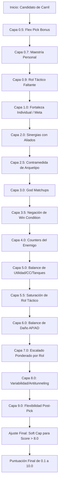

# Motor de Recomendación de Picks (Draft Engine)

Este documento detalla el funcionamiento del motor de recomendación de campeones y bans de HexDraft. Explica la lógica multi-capa del algoritmo de puntuación, la detección de arquetipos y la calibración fina del motor.

---

## Flujo de Ejecución del Scoring (Capas)

Cuando se solicita una recomendación de pick en el carril asignado, se ejecuta la función [getProcessedRecommendations](file:///d:/Documentos/HexDraft/src/lib/engine/engine.ts#L82) (entrypoint principal). Esta itera sobre el pool de campeones viables del rol y califica a cada uno llamando a la función interna [calculateScore](file:///d:/Documentos/HexDraft/src/lib/engine/engine.ts#L580).

A continuación se muestra el diagrama de flujo y orden secuencial de ejecución de las capas dentro del algoritmo:

### Detalle de las Capas y su Ubicación

| Capa | Nombre | Función de Ejecución | Archivo de Origen | Descripción |
| :--- | :--- | :--- | :--- | :--- |
| **0.5** | Flex Pick Bonus | `calculateScore` | [engine.ts](file:///d:/Documentos/HexDraft/src/lib/engine/engine.ts#L630) | Suma `flex_value` a los campeones que pueden flexearse a otras líneas (sólo en Fase 1). |
| **0.7** | Maestría Personal | `calculateScore` | [engine.ts](file:///d:/Documentos/HexDraft/src/lib/engine/engine.ts#L636) | Bonifica o penaliza al candidato utilizando el historial cargado en `PERSONAL_STATS`. |
| **0.9** | Rol Faltante | `calculateScore` | [engine.ts](file:///d:/Documentos/HexDraft/src/lib/engine/engine.ts#L651) | Otorga `tactic_role_bonus` si aporta un rol táctico del que carece el equipo aliado. |
| **1.0** | Meta & Win Rate | `calculateScore` | [engine.ts](file:///d:/Documentos/HexDraft/src/lib/engine/engine.ts#L675) | Suma según el tier global de la tierlist y el winrate actual. Penaliza un 50% de este bono si el arquetipo enemigo no es mixto y el campeón no aporta contramedidas directas a este. |
| **2.0** | Sinergias | `calculateScore` | [engine.ts](file:///d:/Documentos/HexDraft/src/lib/engine/engine.ts#L731) | Evalúa deltas históricos con aliados pickeados. Aplica multiplicador de proximidad física en el mapa y combos de clases compatibles (ej. ADC + Support / Engage + FollowUp). |
| **2.5** | Contramedida de Arquetipo | `calcArchetypeCounterBonus` | [engine.ts](file:///d:/Documentos/HexDraft/src/lib/engine/engine.ts#L491) | Compara roles tácticos y tags contra el arquetipo general enemigo y aliado. |
| **3.0** | God Matchups | `calculateScore` | [engine.ts](file:///d:/Documentos/HexDraft/src/lib/engine/engine.ts#L804) | Bonifica si el campeón es considerado dominador absoluto contra algún campeón enemigo. Multiplicador x2 si coinciden en la misma línea. |
| **3.5** | Negación de Win Condition | `calculateScore` | [engine.ts](file:///d:/Documentos/HexDraft/src/lib/engine/engine.ts#L819) | Premia la anulación de condiciones enemigas (ej. ZoneControl vs Hypercarry, o explotar ausencias de peel/iniciación en el enemigo). |
| **4.0** | Counters Enemigos | `calculateScore` | [engine.ts](file:///d:/Documentos/HexDraft/src/lib/engine/engine.ts#L852) | Resta score según el nivel de dominancia histórica del enemigo. Penaliza un 40% más si el matchup es de fase de líneas crítica ("Bad Lane"). |
| **5.0** | Balance de Utilidad | `calculateScore` | [engine.ts](file:///d:/Documentos/HexDraft/src/lib/engine/engine.ts#L866) | Bonifica la provisión de control de masas (CC), peel, frontline o curación si el equipo no los tiene. |
| **5.5** | Saturación de Rol | `calculateScore` | [engine.ts](file:///d:/Documentos/HexDraft/src/lib/engine/engine.ts#L917) | Penaliza gradualmente si ya hay dos o más aliados con el mismo rol táctico (ej. exceso de poke o burst). |
| **6.0** | Balance de Daño | `calculateScore` | [engine.ts](file:///d:/Documentos/HexDraft/src/lib/engine/engine.ts#L930) | Penaliza las sobrecargas de daño físico (AD) o mágico (AP) aliadas, y premia cubrir la carencia del tipo de daño secundario. |
| **7.0** | Escalado Ponderado | `calculateScore` | [engine.ts](file:///d:/Documentos/HexDraft/src/lib/engine/engine.ts#L965) | Compara el escalado tardío del candidato contra el promedio ponderado del equipo enemigo (donde los hypercarries enemigos pesan x2.5). |
| **8.0** | Variabilidad | `calculateScore` | [engine.ts](file:///d:/Documentos/HexDraft/src/lib/engine/engine.ts#L1039) | Factor de entropía aleatoria entre 0.0 y 0.3 para evitar que las recomendaciones sean siempre idénticas. |
| **9.0** | Flexibilidad Post-Pick | `calculateScore` | [engine.ts](file:///d:/Documentos/HexDraft/src/lib/engine/engine.ts#L1010) | Evalúa cuántos campeones viables quedan en el pool de HexDraft para cubrir las necesidades tácticas en las fases posteriores del draft. |

---

## Detección de Arquetipos y Contramedidas (Capa 2.5)

El motor detecta el arquetipo del equipo enemigo parcial con la función [detectEnemyArchetype](file:///d:/Documentos/HexDraft/src/lib/engine/compositionAnalyzer.ts#L79) y el del equipo aliado con [detectAllyArchetype](file:///d:/Documentos/HexDraft/src/lib/engine/compositionAnalyzer.ts#L104).

Si el arquetipo enemigo es definido (no es `'mixed'`), se invoca a `calcArchetypeCounterBonus` para cruzar los tags y roles tácticos del candidato con la tabla de efectividad `COUNTER_MAP`:

* **Matriz de Efectividad (COUNTER_MAP):**
  * `siege` (Asedio) ➔ Contrabaneado/Contrado por `roles: ['siege','utility']` y `tags: ['ZoneControl','Disengage']`.
  * `engage_heavy` (Iniciación) ➔ Contrado por `roles: ['poke','disengage']` y `tags: ['Poke','Disengage','Shield','Shielding']`.
  * `poke` (Desgaste) ➔ Contrado por `roles: ['dive','engage']` y `tags: ['Dive','Gap Close','Tank','Frontline']`.
  * `pick_comp` (Cazar objetivos) ➔ Contrado por `roles: ['peel','teamfight']` y `tags: ['Peel','Grouping','Frontline']`.
  * `scaling` (Escalado) ➔ Contrado por `roles: ['skirmish','dive']` y `tags: ['EarlyPressure','Pick','Dive']`.
  * `split_push` (Presión paralela) ➔ Contrado por `roles: ['teamfight','utility']` y `tags: ['Global','Teleport','Engage']`.
  * `teamfight` (Pelea de equipo) ➔ Contrado por `roles: ['poke','burst']` y `tags: ['Poke','Burst','Disengage','Kite']`.

Adicionalmente, se realiza un **Doble Análisis** evaluando si el candidato apoya el arquetipo del equipo aliado frente al enemigo (por ejemplo, si jugamos *Protect the Carry* y el enemigo tiene *Engage Heavy*, se incrementa la valoración de campeones con tags de *Peel* o *Shield*).

---

## Negación de Win Condition Enemiga (Capa 3.5)

Esta capa evalúa de forma activa la anulación de mecánicas cruciales en los campeones del equipo enemigo:
1. **Control de Zona vs Hypercarry:** Si el enemigo tiene un hypercarry de escalado tardío (ej. Jinx o Kayle) y el candidato aporta `ZoneControl` (ej. Azir o Anivia), se le concede un bono de `0.8` debido a que la delimitación de zonas le complica el posicionamiento al carry.
2. **Explotación de Carencias:** Cruza la lista de necesidades tácticas (`teamNeeds`) del enemigo contra el rol del candidato.
   * Si el enemigo carece de iniciación (`engage`) y el candidato es excelente haciendo asedio o empuje dividido (`poke`, `siege`, `splitpush`), se concede un bono de `0.6`.
   * Si el enemigo carece de protección (`peel`) y el candidato aporta capacidad de salto o ráfaga directa (`dive`, `burst`), se le otorga un bono de `0.6`.

---

## Tabla de Calibración Rápida

Si deseas ajustar o calibrar la sensibilidad del motor de draft, puedes editar los siguientes parámetros:

| Si quiero ajustar... | Modifico el archivo... | En la constante/línea... |
| :--- | :--- | :--- |
| El peso de la sinergia en las recomendaciones | [engine.ts](file:///d:/Documentos/HexDraft/src/lib/engine/engine.ts#L7) | `engineWeights.synergy` (default: 0.8) |
| El peso de los counters directos | [engine.ts](file:///d:/Documentos/HexDraft/src/lib/engine/engine.ts#L7) | `engineWeights.counter` (default: 0.35) |
| El impacto del escalado tardío | [engine.ts](file:///d:/Documentos/HexDraft/src/lib/engine/engine.ts#L7) | `engineWeights.scaling` (default: 1.0) |
| El peso de los bans calculados en base a counters | [engine.ts](file:///d:/Documentos/HexDraft/src/lib/engine/engine.ts#L190) | Coeficiente `dangerWeight` y factor de pick.score en `getProcessedBans`. |
| La bonificación de Flex Picks en Fase 1 | [engine.ts](file:///d:/Documentos/HexDraft/src/lib/engine/engine.ts#L7) | `engineWeights.flex_value` (default: 0.6) |
| Los multiplicadores aplicados en cada fase de pick | [engine.ts](file:///d:/Documentos/HexDraft/src/lib/engine/engine.ts#L587) | El objeto `PHASE_WEIGHTS` (separa picks en Fase 1, 3 y 5). |
| La penalización por saturación de rol táctico | [engine.ts](file:///d:/Documentos/HexDraft/src/lib/engine/engine.ts#L919) | Valores de `penaltyBase` por rol táctico (ej: `1.2` para poke/burst). |
| La entropía aleatoria aplicada al draft | [engine.ts](file:///d:/Documentos/HexDraft/src/lib/engine/engine.ts#L1040) | Multiplicador de `Math.random()` (default: 0.3). |
